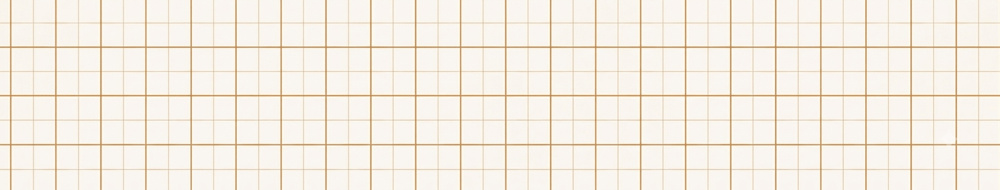
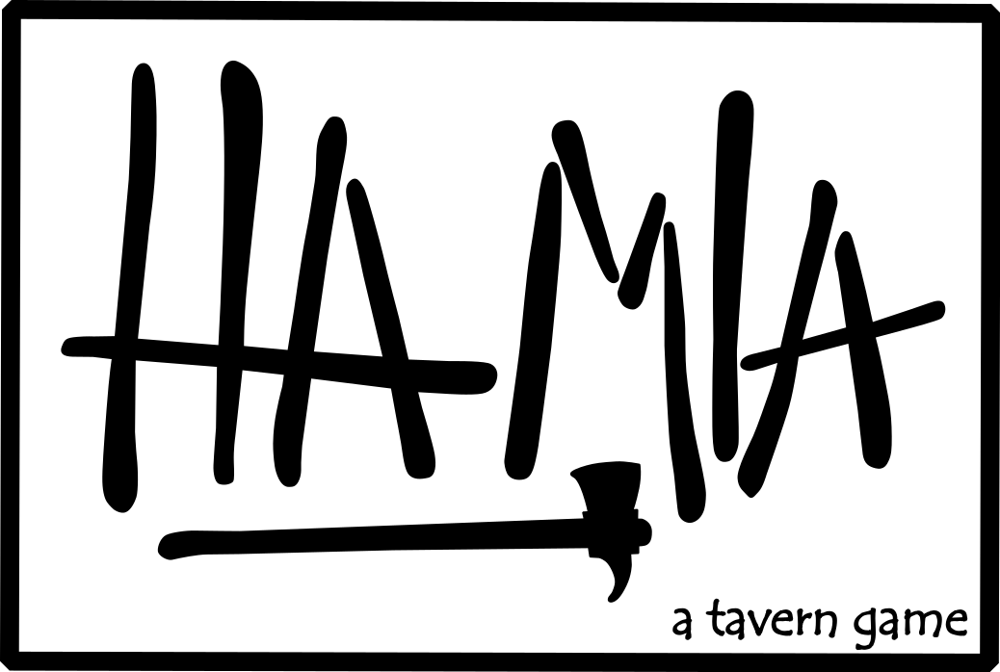

# Papelon Studio — Landing Page

**[papelonstudio.me](https://papelonstudio.me/)**

*Kickstarter campaign site for an independent board game studio*

 

<!-- TODO: full-page screenshot or scroll GIF goes here -->

 

It exists to do one thing: introduce the studio and its two games, and collect email
signups ahead of a Kickstarter launch. The form sits above the fold, the game sections
below give people a reason to fill it in, and nothing else competes for attention.

 

<table>
<tr>
<td width="50%" align="center">
 
</td>
<td width="50%" align="center">
 
</td>
</tr>
</table>

## Details

- **Design** — grid-paper backgrounds, a paper palette and a monospace face: a
  deliberate nod to making physical games rather than a clean SaaS look
- **Layout** — ~380 lines of custom CSS and ~150 of Hugo template overrides on top of
  the base theme, responsive across two breakpoints
- **Sharing** — most traffic arrives through a shared link, so the preview card is part
  of the page; Open Graph tags come from the theme, title construction is customised in
  the layout override
- **Signup form** — hand-written rather than a dropped-in widget: intercepts the submit,
  POSTs JSON to a third-party form API, and resolves in place with inline success and
  error states, plus a honeypot for bots

## Built with

Hugo (extended) · vanilla JavaScript · GitHub Actions → GitHub Pages, on push to `main`

Base theme is [re-terminal](https://github.com/mirus-ua/hugo-theme-re-terminal),
vendored, with overridden layouts in `layouts/` and custom styling in `static/style.css`.

## Known issues

- `showLanguageSelector` is enabled but only English is configured, so the selector has
  nothing to switch to
- The built `public/` directory is committed even though the workflow builds it —
  it should be gitignored
- A few working art files (`.kra`, `.HEIC`, editor backups) are sitting in
  `static/images/` and get published with the site
