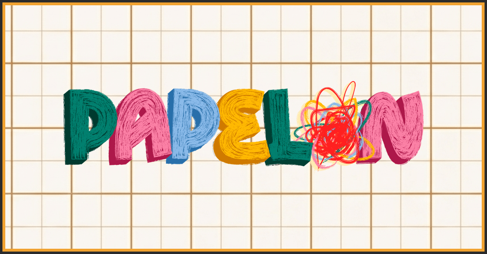

# Papelon Studio — Landing Page

> [!TIP]
> **Live at [papelonstudio.me](https://papelonstudio.me/)** — in English, Español and Svenska.



Pre-launch site for an independent board game studio on Gotland. Its job is email
signups ahead of a Kickstarter: form above the fold, game sections below, nothing
else competing for attention.

## Details

| | |
|:--|:--|
| **Design** | Grid-paper backgrounds, a paper palette and a monospace face — a deliberate nod to making physical games rather than a clean SaaS look |
| **Performance** | Every image audited against its actual display size and re-encoded per image. The About page went from 44 MB to 2.5 MB with no visible change |
| **Trilingual** | Hugo multilingual across three languages. Text-fitting constants turn out to be language-specific, so the form title uses `clamp()` with a `:lang()` override and the stat badges use a container query |
| **Signup form** | Hand-written, not a widget. Degrades to a native POST without JavaScript, and an `AbortController` stops a hanging request leaving the button dead |
| **Responsive** | Verified by an automated sweep across 3 pages × 9 widths from 320–1200px, plus a 25px step scan for sudden jumps in element size |

## Results

| | Desktop | Mobile |
|:--|--:|--:|
| Performance | 95 | 78 |
| Accessibility | 93 | 93 |
| Best Practices | 100 | 100 |
| SEO | 100 | 100 |

Lighthouse against the live URL. Pages weigh 2.1–2.6 MB. Mobile is limited by
image bytes rather than by code: blocking time is 30ms and layout shift is 0.

## Built with

`Hugo (extended) 0.164.0` `vanilla JavaScript` `GitHub Actions` `GitHub Pages`

Deploys on push to `main`. Base theme is
[re-terminal](https://github.com/mirus-ua/hugo-theme-re-terminal), vendored and
never edited — overrides live in `layouts/` and `static/style.css`.

```bash
hugo server -D    # English at /, plus /es/ and /sv/
```
